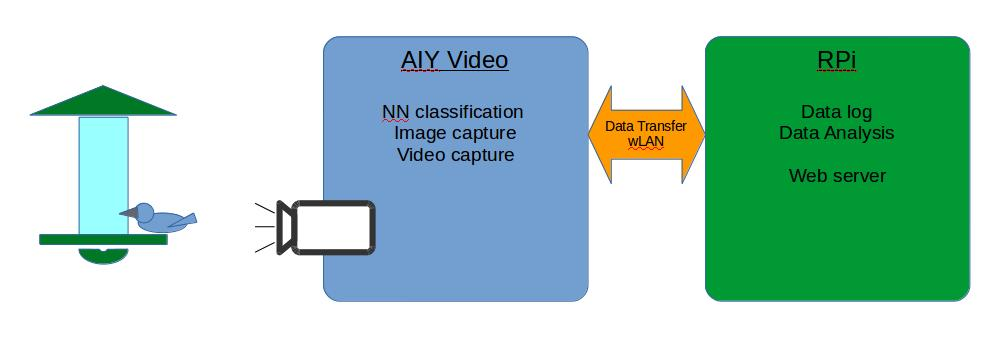

# BirbWatch v1

BirbWatch is an automated [backyard birding](https://en.wikipedia.org/wiki/Birdwatching) robot.  BirbWatch uses a
neural network to classify birds found in video streaming of a backyard birdfeeder.  The bird classification 
instances are filtered to a data log.  At random intervals bird images and video are captured to periodically
assess the classification accuracy.  The historical data log and sample images are displayed to a webpage hosted 
[here](TODO).

### System Diagram

###

### AIY Vision System

__Overview__
 - Enable remote access
 - On startup lanuches AIY INaturalist bird identification NN
 - Streams predicted bird sighting classification to a filter function
    - Filter function combines a window of video frame classification predictions to give confidence in sighting
    - Filter function writes predicted sighting to a text log file
    - At random intervals (maximum frequency) the image with predicted sighting and bounding box are also saved
    - After a set period of time the text log file and captured images are transfered to the RPi database 
        - log file and image data are cleared
        
#### Remote Access AIY System

 1. SSH Access to AIY System:
 
    SSH is enabled on the RPi0 through Pi Config:
     [see raspberrypi.org docs](https://www.raspberrypi.org/documentation/remote-access/ssh/)
        
    From the CLI of the computer you are accessing from type `ssh pi@[rpi0 IP address]`
    Enter AIY system password and prompt: AIY******
    
 2. From AIY SSH CLI lauch VNC server:
 
    with ssh terminal enter: `pi@rasberrypi:~ $ vncserver`
    
    VNCviewer will launch a new desktop on raspberrypi and provide an address eg. 192.168.1.1:1
    
 3. Launch VNCviewer from the computer you are accessing from and enter the address for the new desktop from step 2.
    
    Enter AIY password when prompted
    
 4. `vncserver -kill :<vnc display number>` to end virtual desktop
    
    
#### AIY Runs inaturalist_birbwatch.py automatically

 1. The AIY RPi0 is setup to run a cronjob as follows:
 
 
    
 
    
        
### RPi

__Overview__
 - Collects new text data log files from AIY Vision System and appends existing database
 - Collects new captured images, deleted old batch of images:
    - Updates website with new image
    - Potential to submit image to online NN to spot check error rate
 - Runs data analysis and data visualization scripts on database
 - Hosts website that displays the updated data analysis 
  

### How to transfer files to AIY RPi

#### Initial Steps:
1.Connect both the Linux Computers in Network using a Ethernet cable or Wifi  and assign a static IP address for both the systems.
For example: Set the IP address of PC I as 192.1681.1 and assign the IP address of PC II as 192.168.1.4 and set the default gateway as 192.168.1.1.
2.  Ping the IP address of PC II from PC I using ping command.
ping
For Example:
ping 192.168.1.4

3.If you get a successful ping reply you have successfully configured your network
#### File Transfer:
To transfer file from your PC to PC II use the command.
scp /home/yourusername/examplefile username2@ip2:/home/username2/
For Example:
I am transferring a file named wine from my home directory to the home directory of PC II by the command.
$ scp /home/rajamalw/wine raj@192.168.1.4:/home/raj/

#### Folder Transfer:
To transfer a folder from your PC to PC II use the command.
scp -r /home/yourusername/folder/ username2@ip2:/home/username2/
For Example:
I am transferring a folder named files from my home directory to the home directory of PC II by the command.
$ scp -r /home/rajamalw/files/ raj@192.168.1.4:/home/raj/

### What does AIY RPi do when booted

### Where are the files and what do they do

### Links to important help pages

